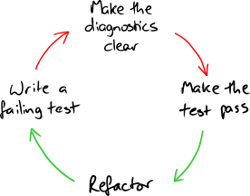

# 5. 테스트 주도 개발 주기의 유지
이번 장은 일단 시작된 TDD 프로세스가 어떻게 운영되는지 설명한다.

## 5.1. 각 기능을 인수 테스트로 시작하라

- 인수 테스트는 그 기능이 완성되기 까지 진행 상황을 반영한다.

- 인수 테스트를 작성할 때는 도메인에서 나온 용어만 이용한다.
    - 시스템이 해야할 일을 이해하는데 도움이 된다.
    - 테스트가 기술적인 세부 사항으로 복잡해지지 않는다.
    - 시스템의 기술 기반 구조가 바뀌었을 때도 인수 테스트를 보호할 수 있다.
- 인수 테스트로 시작하면 사용자 관점에서 시스템을 바라보게 되어 사용자가 필요로 하는것을 이해하게 된다.
- 단위테스트는 클래스가 시스템의 나머지 부분과 조화롭게 동작하는지에 대해서는 담보하지 않는다.
- 인수테스트는 통합테스트를 수행하고, 프로젝트를 앞으로 나아가게 한다.

## 5.2. 회귀를 포착하는 테스트와 진행 상황을 측정하는 테스트를 분리하라

- 인수테스트를 빨간색에서 녹색으로 바꾸는 활동으로 진행 상태를 측정 할 수 있다.
- 정기적인 인수테스트 통과 주기는 중첩된 프로젝트 피드백 고리를 구동하는 엔진에 해당한다.
    - 인수테스트를 통과하면 해당 테스트는 완료된 기능을 나타내고 다시는 실패 해서는 안 된다.
    - 완성된 기능에 대한 인수 테스트는 실행하는데 시간이 오래 걸려도 늘 통과해야 한다.
- 요구사항이 바뀌면 거기 영향을 받은 인수 테스트를 회귀 테스트 그룹에서 빼내서 진행중인 테스트 그룹으로 옮긴 후 테스트를 수정하고, 테스트를 통과 하게끔 변경을 해야한다.

## 5.3. 테스트를 가장 간단한 성공 케이스로 시작하라

- 간단하기만 한 테스트는 아이디어의 유효성에 관해 충분한 피드백을 전해주지 않는다.
- 기능 구현을 시작할때 실패 케이스에만 집중하면 의욕을 진작하는데 좋지 않다.
- 테스트가 동작하면 구조에 대한 더 좋은 아이디어가 생길 수 있고, 그 과정에서 발견한 발생 가능한 실패를 처리하는 것과 이후의 성공 케이스 사이에서 우선순위를 가늠해볼 수 있다.
    - 구현을 먼저 하려고 할때 둘 중 하나를 선택할 수 있다는 의미
- 처리해야 할 작업을 메모장이나 색인 카드에 기록해 두면 세부 사항을 빠트리지 않고 당면 과제에 집중할 수 있다.

## 5.4. 읽고 싶어 할 테스트를 작성하라

- 테스트를 잘 읽히게 만들고 지원하는 기반 구조를 만든다.
- 테스트가 어떻게 해야 할지 기술하는 명확한 오류 메세지를 보이도록 작성
    - 21장) 테스트 가독성을 높이는 방법

## 5.5. 테스트가 실패하는 것을 지켜보라

- 테스트의 실패에 대한 설명이 명확하지 않으면 오류 메세지가 코드와 관련된 문제로 이끌 때까지 테스트 코드를 조정하고 테스트를 재실행한다.
    - 오류 메세지를 늘 명확하고 의미있게 만든다.

- 오류 메세지를 검사해야 하는 이유
    - 작업중인 코드에 대한 가정을 확인한다. (잘못된 가정을 세울 때도 있다.)
    - 신뢰있고 유지하기 쉬운 시스템을 개발하는데 필수
    - 23장) 오류 정보를 개선하는 방법

## 5.6. 입력에서 출력 순서로 개발하라

- 외부 이벤트를 받아 중간 계층을 거쳐 도메인 모델을 실행하고 외부에 응답을 생성하는 순서로 개발하는게 좋다.
- 도메인 모델 작업부터하면 처음에는 쉬워보이지만 나중에는 통합 문제가 발생할 가능성이 높다.
    - 도메인 모델을 개발할때 올바른 피드백을 받지 못하기 때문에 올바르지 않은 기능을 구현하느라 시간을 낭비 할 수 있다.

## 5.7. 메서드가 아닌 행위를 단위 테스트하라

- 해당 클래스의 코드를 통해 모든 실행 경로를 시험하는 방법이 아니라 그 클래스로 목표를 달성하는 방법을 알아야 한다.
- 각 객체의 책임이 무엇이고 객체의 메서드들이 어떻게 동작하는지 이해할 수 있도록 테스트를 작성해야 나중에 이해하기 쉽다.
- 테스트 이름은 객체가 어떻게 동작하는지 설명하는 이름을 선택하는것이 좋다.
    - P.286) 테스트 이름은 기능을 기술한다

## 5.8. 테스트에 귀를 기울여라

- 테스트를 작성하기 어려울때 주로 설계 개선이 필요한 경우가 많다.
- 이 경우 테스트를 작성하는 과정을 잠재적인 유지보수 문제를 조기에 알려주는 경고로 여기고 아직 심각하지 않을때 문제를 해결한다.
- 다음으로 실패할 테스트를 작성하기 어려울때 코드 설계를 다시보고 앞으로 나가기전 리팩토링 한다.

- 설계에 취약함이 보일때 리팩토링을 통해 시스템 품질을 유지한다면 어떠한 변화가 일어나도 대응할 수 있다.
    - 20장) 테스트에 귀 기울이기

## 5.9. 주기의 미세 조정

- 실행 경로를 철저하게 테스트하는 것과 통합을 테스트하는 것 사이에는 균형을 이루는 지점이 있다.
- 팀이 처한 상황과 환경에 따라 테스트 전략의 조정이 필요하다.
